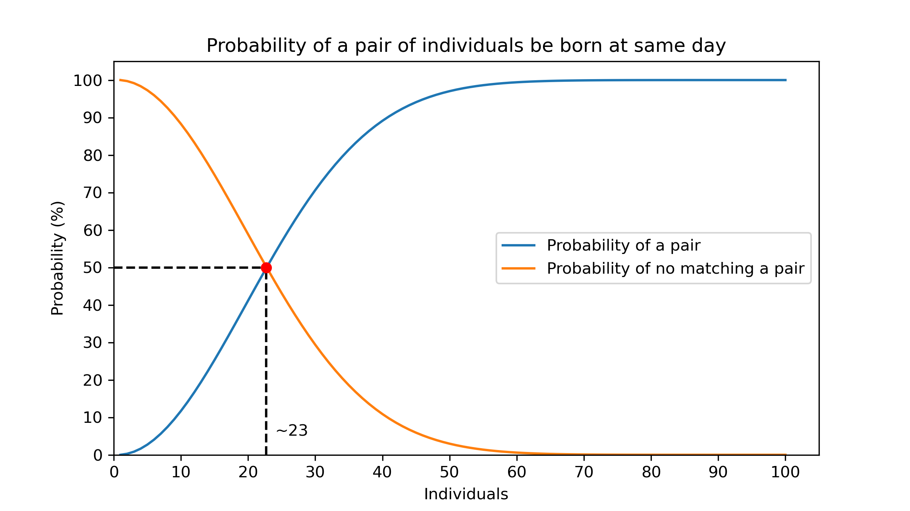
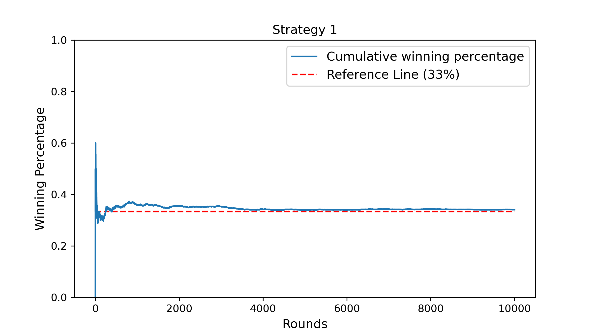
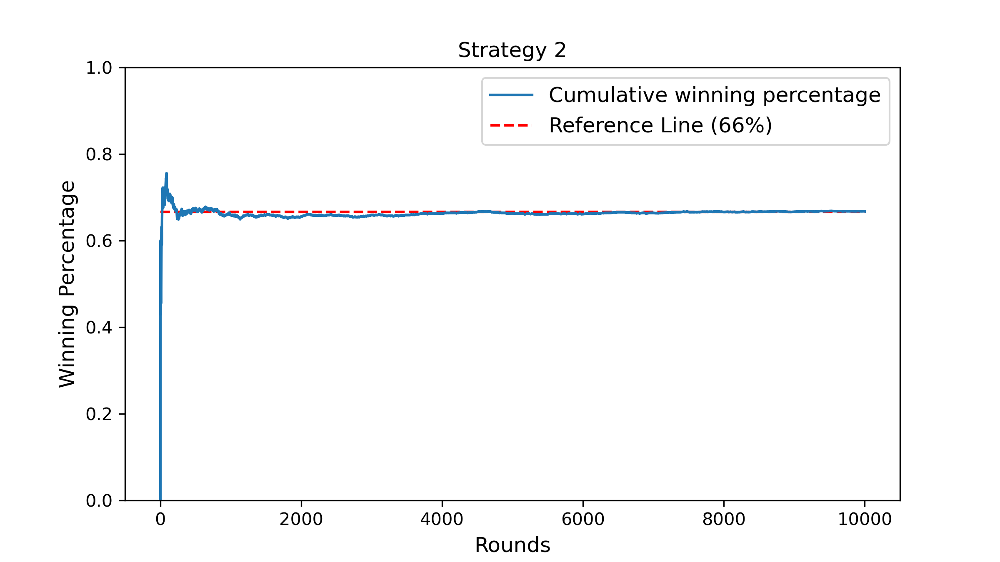

# Repository of Random/Fun codes :penguin:

## Table of contents
- [Birthday paradox](Birthday_Paradox)
- [Brasil.io downloader function](Brasil_io)
- [Fibonacci Sequence function](Fibonacci)
- [Monty Hall test](Monty_Hall)
- [Moving Average of COVID-19 in Brazil](MM_covid)

---

### :balloon::tada: Birthday paradox ([Python](Birthday_Paradox/birthday_paradox.py) | [Jupyter Notebook](Birthday_Paradox/Birthday_Paradox.ipynb))

---

### :truck::package: Brasil.io downloader function ([R](Brasil_io/download_brasilio.R) | Translated from [Python](https://gist.github.com/turicas/3e3621d61415e3453cd03a1997f7473f))

---

### :1234::symbols: Fibonacci Sequence funtion ([Python](Fibonacci/fibonacci.py))

---

### :door::door::door::gift: Monty Hall test ([Python](Monty_Hall/monty_hall.py) | [Jupyter Notebook](Monty_Hall/Monty_Hall.ipynb))
Strategy 1 |
:---:|
 |

Strategy 2 |
:---:|
 |

---

### :chart_with_upwards_trend::mask: Moving Average of COVID-19 in Brazil ([R](MM_covid/mm_csse.R))
Confirmed cases |
:---: |
 |

Deaths |
:---: |
 |